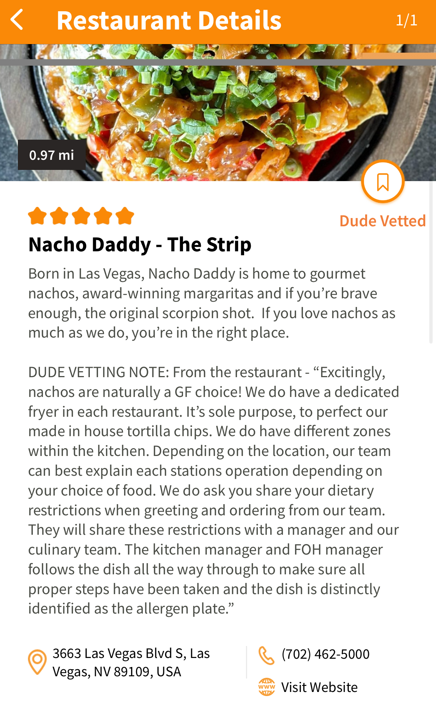
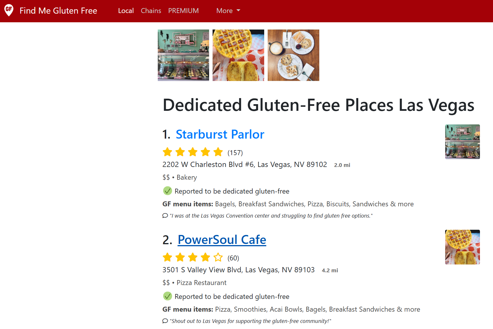

# Gluten Free Food Finder Apps
Ever wonder how everyone is finding all these great gluten free places to eat at? Look no further! Here is a collection of apps that we have used to find safe places for us to eat.

---
## Gluten Dude
The [Gluten Dude](https://glutendude.app/) restaurant finding app does require a subscription, however, all of the establishments in the app are screened by the Gluten Dude team to make sure that they are safe for dining. The app features a list and map of vetted restaurants, forums for app subscribers, a listing of GF locations at airports around the world. The [Gluten Dude](https://glutendude.com/) website also has a ton of other resources regarding celiac and gluten free. 

The app offers a 7 day free trial, after the trial expires you can purchase the app through the app store on a subscription basis, or wait until the lifetime pass is on sale and purchase it that way. Sale prices range from ~$50  to ~$100 USD for a lifetime pass depending on the sale.

## Find Me Gluten Free
[Find Me Gluten Free](https://www.findmeglutenfree.com/) has a large amount of restaurants that are rated all around the world. This app allow users to review restaurants for the quality of the food, how safe it is, and variety of gluten free food available. You can also search for all restaurants that are dedicated gluten free facilities. This is a free app, but there are additional features that you can access for a subscription fee. 

